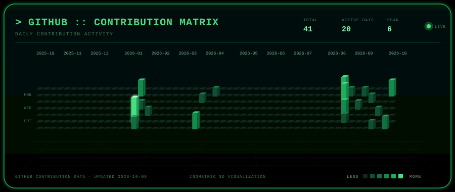

<!-- Save this as README.md in a public repo named exactly: Anupam2400/Anupam2400 -->

<div align="center">

[](https://anupam-mishra.netlify.app)

[](https://anupam-mishra.netlify.app)

### `Data Engineering` • `Machine Learning` • `Algo Trading` • `RAG` • `Geospatial` • `Open Source`

[](https://anupam-mishra.netlify.app)
[](https://www.linkedin.com/in/anupam-mishra-34532819a/)
[](mailto:anupammishra731@gmail.com)
[](https://github.com/Anupam2400)


</div>

---

## `> SYSTEM_PROFILE`

```yaml
name: Anupam Mishra

role:
  - Python Developer
  - Data Engineer / Data Analyst
  - ML & Analytics Engineer
  - RAG / Document Intelligence Developer
  - Geospatial Data Developer
  - Open Source Contributor

education:
  - MBA, Business Analytics

current_focus:
  - MLflow-based experiment tracking
  - Business-driven ML dashboards
  - Retrieval-Augmented Generation with local LLMs
  - Geospatial data processing and mapping
  - Swarm intelligence and drone fleet software
  - Performance optimization in the Python data ecosystem

mission: |
  "Turn messy data and complex systems into tools
   that people actually use to make decisions."
```

---

## `> ABOUT_ME`

- 🐍 **3+ years** building with **Python** across data science, analytics and data engineering
- 📈 Built and backtested **30+ trading algorithms** across equities, gold, silver and crypto
- 📊 Building **ML-powered analytics dashboards** that connect models to business decisions
- 🎓 **MBA in Business Analytics**: I speak both "stakeholder" and "stack trace"
- 🧠 Built **RAG systems** with LangChain, FAISS, HuggingFace embeddings and local LLMs (Ollama)
- 🗺️ Worked with **geospatial data**: coordinates, distances, geofences and map-based workflows
- 🚁 Day job at **Botlab Dynamics**: fleet analytics, hardware validation and drone light show systems
- ⚡ Open-source contributor focused on **performance**: vectorization, fewer allocations, lower memory
- 🌍 Aiming for **Google Summer of Code 2027**

---

## `> HIRE_ME`

> Full case studies and contact details live on my portfolio: **[anupam-mishra.netlify.app](https://anupam-mishra.netlify.app)**

| | What I build | Typical stack |
| :-: | :--- | :--- |
| ⚡ | **Algorithmic trading systems**: live execution, backtesting, P&L and risk reports | `Python` `SQL` `Backtesting` |
| 🎯 | **Automation**: ETL pipelines, PDF reports, Telegram alerts, so manual work stops | `Python` `ETL` `Telegram` |
| 🧠 | **Predictive ML**: forecasting, anomaly detection, RAG over your documents | `Scikit-Learn` `LangChain` `LLMs` |
| ⚙️ | **Data engineering**: pipelines from spreadsheets, PDFs and S3 into clean, queryable data | `AWS` `PostgreSQL` `Snowflake` `Power BI` |

### Results so far

| 70% | 100% | 25% | 30+ |
| :-: | :-: | :-: | :-: |
| deployment latency cut (4 hrs to 1 hr) | manual P&L reconciliation eliminated | strategy ROI improved with supervised ML | algo strategies built and backtested |

[](https://anupam-mishra.netlify.app/#contact)

---

## `> OPEN_TO`

| 🤝 | **Collaborating on open-source Python projects** |
| --- | --- |
| ⚡ | Performance fixes: replacing slow `.apply()` paths with vectorized code |
| 📊 | Analytics / ML dashboard projects |
| 🧠 | RAG / document-intelligence projects |
| 🗺️ | Geospatial data tooling |
| 🧪 | Benchmarks, tests and CI improvements |
| 💬 | Mentorship, code review and good-first-issue pairing |

> 💡 **Got an issue that is slow, memory-hungry or stuck?** Tag me, I like those.

---

## `> TECH_STACK`

### Languages & Frameworks
[](https://skillicons.dev)


### Data, ML & Analytics
[](https://skillicons.dev)


### Cloud & Databases


### RAG & AI


### Geospatial, Real-Time & Drone Systems


---

## `> ENGINEERING_DOMAINS`

| 📊 Data & ML | 📈 Algo Trading | 🧠 RAG & AI | 🗺️ Geospatial | 🚁 Drone Systems |
| :--- | :--- | :--- | :--- | :--- |
| Analytics dashboards | Strategy backtesting | Document intelligence | Coordinate & distance logic | Fleet analytics |
| ML experiment tracking | Live execution | Vector search (FAISS) | Geofencing | Hardware validation |
| ETL & data pipelines | P&L and risk reports | Local LLMs (Ollama) | Map-based workflows | Light show software |
| Performance optimization | Volatility clustering | Entity linking | Spatial data handling | Telemetry, MAVLink |

---

## `> OPEN_SOURCE`

| Project | Contribution |
| :--- | :--- |
| [**pyjanitor**](https://github.com/pyjanitor-devs/pyjanitor) | Performance and memory optimizations: vectorizing `.apply()` paths, cutting allocations. Latest merged: [#1655](https://github.com/pyjanitor-devs/pyjanitor/pull/1655), building the `pivot_longer` reorder indexer with a single NumPy allocation |
| *Next* | Looking for more Python repos where a benchmark-backed speedup can help |

**My playbook:** find a hot path → benchmark it → vectorize it → prove the speedup → open a small, reviewable PR.

---

## `> FEATURED_PROJECTS`

| Project | What it does | Stack |
| :--- | :--- | :--- |
| [**ml-analytics-dashboard**](https://github.com/Anupam2400/ml-analytics-dashboard) | ML-powered customer analytics dashboard | `Python` |
| [**LAN_Listening_Room**](https://github.com/Anupam2400/LAN_Listening_Room) | Self-hosted, real-time synchronized music room for your LAN, with YouTube, Spotify, local audio, chat and co-host system | `FastAPI` `WebSockets` |
| [**aree-yaar**](https://github.com/Anupam2400/aree-yaar) | Plays a sound whenever your code has errors. Get yelled at for every mistake! | `TypeScript` |

📂 More case studies (trade and portfolio dashboards, ETL pipelines, RAG apps, drone show management) are on my [portfolio](https://anupam-mishra.netlify.app/#proj).

---

## `> GITHUB_ANALYTICS`

<div align="center">

[](https://github.com/Anupam2400)
[](https://github.com/Anupam2400)

[](https://github.com/Anupam2400)

</div>

---

## `> CONTRIBUTION_ACTIVITY`

<div align="center">

[](https://github.com/Anupam2400)

</div>

---

## `> CONNECT`

<div align="center">

[](https://anupam-mishra.netlify.app)
[](https://github.com/Anupam2400)
[](https://www.linkedin.com/in/anupam-mishra-34532819a/)
[](mailto:anupammishra731@gmail.com)

```
┌──────────────────────────────────────────────────────────┐
│  Turning data, models and real-time systems into tools   │
│  people can actually use.                                │
└──────────────────────────────────────────────────────────┘
```

### `Stay curious. Ship small. Benchmark everything.` 🚀

[](https://anupam-mishra.netlify.app)

</div>